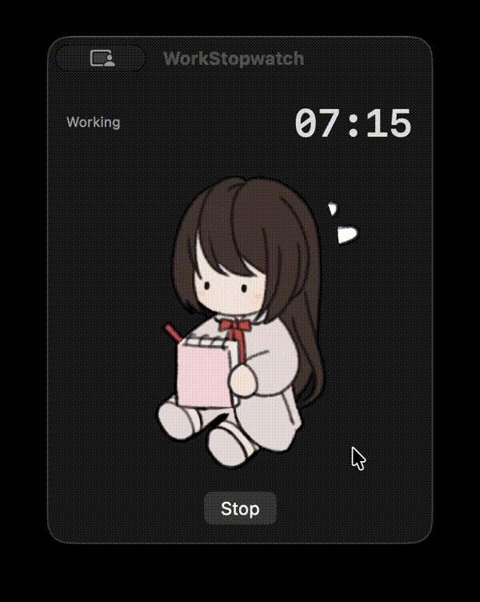

# WorkStopwatch

A macOS menu bar stopwatch with an animated character that reacts to your work and break states. Customizable, Shortcuts-friendly, and unobtrusive.


## Why

This project started because of [this Windows-only timer on Acon3D](https://www.acon3d.com/ko/product/1000047699) — a charming character-based project timer that I really wanted to use, but couldn't, because I'm on macOS. Rather than dual-boot or run a VM just for a stopwatch, I built my own.

WorkStopwatch isn't a port — the visuals, behavior, and integration are different — but the original spirit is the same: most timers are just numbers, and a small illustrated character beside your work makes focus sessions feel less mechanical. She sits at her desk while you work, takes a break when you stop, eventually disappears if you stay away too long.

Designed primarily for personal use with Apple Shortcuts, where one button press can start a calendar event and the timer at the same time.

## Features

- **Menu bar timer** — live elapsed time (`MM:SS` or `HH:MM:SS`)
- **Animated character window** — five phases, each with its own GIF
- **Apple Shortcuts integration** — Start, Stop, and Toggle as native App Intents
- **Fully customizable** — replace any phase image with your own GIF
- **Sandboxed file access** — uses security-scoped bookmarks so custom images persist across restarts
- **Toggleable floating window** — keep it visible, or run menu-bar-only

### Phases

| Phase | When | Default image |
|---|---|---|
| Working | Stopwatch running | Character taking notes |
| Short break | 0–10 min after stop | Character resting |
| Phone call | 10–30 min after stop | Character reaching for phone |
| Gone | 30+ min after stop | Empty desk, phone buzzing alone |
| Idle | Initial state, before first run | Character sitting (falls back to Gone if no idle image) |

Phase transitions happen automatically; the GIF swaps without any user action at the 10-min and 30-min marks.

## Requirements

- macOS 13 or later (14+ recommended for full Shortcuts/App Intents support)
- Xcode 15 or later
- An Apple ID (Personal Team is fine; no paid Developer Program needed)

## Build & Install

WorkStopwatch is distributed as source — clone and build in Xcode.

```bash
git clone https://github.com/<your-username>/WorkStopwatch.git
cd WorkStopwatch
open WorkStopwatch.xcodeproj
```

In Xcode:

1. Select the **WorkStopwatch** target
2. **Signing & Capabilities** → choose your team (Personal Apple ID works)
3. **Cmd + R** to build and run

For permanent installation:

1. **Product → Archive**
2. **Distribute App → Custom → Copy App**
3. Drag the resulting `.app` into `/Applications`

> Note on signing: Personal Team certificates expire after 7 days. The simplest workaround for personal use is to re-build occasionally. For a longer-lived signing, you'd need an Apple Developer Program membership ($99/yr).

## Usage

**Menu bar icon (left click)** — opens a popover with the timer, phase, Start/Stop/Reset, and a preview of the current image.

**Menu bar icon (right click)** — quick menu with **Open Settings…** and **Quit**.

**Floating window** — appears on Start (if enabled in Settings). Drag any edge to resize; the GIF scales proportionally.

**Window behavior** — the floating window is a normal window, so other apps can move in front of it. Click WorkStopwatch in the Dock to bring it back.

### Apple Shortcuts

After running the app once, three actions become available in Shortcuts.app:

- **Toggle Stopwatch** — start if stopped, stop if running (recommended)
- **Start Stopwatch**
- **Stop Stopwatch** — returns elapsed seconds

Typical setup: one personal shortcut creates a Calendar event and calls **Toggle Stopwatch**. Pressing the shortcut again updates the event end time and stops the stopwatch.

If actions don't appear in Shortcuts after building, **Product → Clean Build Folder** (`Cmd + Shift + K`) and run again — App Intents metadata is extracted at build time and occasionally needs a clean rebuild.

### Custom images

1. Right-click the menu bar icon → **Open Settings…**
2. For each phase, click **Browse…** and pick any GIF or static image
3. Click **Reset** on a row to fall back to the bundled default

Custom selections persist across app restarts via security-scoped bookmarks.

## Customization

### Change phase durations

Edit constants at the top of `StopwatchModel.swift`:

```swift
static let shortBreakLimit: TimeInterval = 10 * 60   // 0..10 min after stop
static let phoneCallLimit: TimeInterval  = 30 * 60   // 10..30 min after stop
```

### Swap default images

Replace the GIFs in `WorkStopwatch/DefaultImages/` with your own, keeping the filenames:

```
working.gif       shortbreak.gif    phonecall.gif
gone.gif          idle.gif
```

### Add a new phase

1. Add a case to `WorkPhase` in `StopwatchModel.swift`
2. Add a corresponding `BookmarkedImage` instance
3. Update `recomputePhase()` and `bookmark(for:)`
4. Add a `BookmarkRow` to `SettingsView` in `Views.swift`

## Project structure

| File | Role |
|---|---|
| `WorkStopwatchApp.swift` | App entry, AppDelegate, status item, window management |
| `StopwatchModel.swift` | Timer, phase machine, `BookmarkedImage` (security-scoped bookmarks), bundled defaults |
| `Views.swift` | SwiftUI views: popover, floating window, settings; `ScalingImageView` for GIF rendering |
| `Intents.swift` | App Intents: Start / Stop / Toggle |
| `DefaultImages/` | Bundled fallback GIFs for each phase |

## Known limitations

- The stop time is not persisted across app restarts. If you quit while stopped, the phase resets to `idle` on next launch (no "you've been away for 2 hours" detection across restarts).
- Animated GIFs are loaded entirely into memory via `NSImage(data:)`. Very large GIFs (tens of MB) may use noticeable RAM.
- Personal Team signing in Xcode occasionally produces inconsistent App Intents discovery in Shortcuts; a clean build usually fixes it.
- App Sandbox is enabled and requires the **User Selected File: Read/Write** entitlement, which is configured in `WorkStopwatch.entitlements`.

## Contributing

This was built as a personal tool, but PRs are welcome — especially for:

- Persistent stop time across restarts
- Hardened Runtime / notarization workflow for distributed builds
- Localizations

## License

This project uses **dual licensing**:

- **Source code** (`.swift` files, project configuration) — [MIT](LICENSE-CODE). Free to use, modify, and redistribute.
- **Character illustrations and GIF assets** in `DefaultImages/` — [CC BY-NC-ND 4.0](LICENSE-ASSETS). Personal use only as bundled with this app; **no redistribution, modification, or commercial use**.

See [LICENSE](LICENSE) for the overview.

If you fork this project to ship with different art, simply replace the files in `WorkStopwatch/DefaultImages/`. Your replacement assets are subject to whatever license you choose.

## Credits

- Built with SwiftUI, AppKit, and App Intents
- Default character art drawn by the project author
- Inspired by [프로젝트 타이머 (이 프로젝트 하는데 얼마나 걸렸지?)](https://www.acon3d.com/ko/product/1000047699) on Acon3D — a Windows-only character-based timer that motivated me to build a macOS counterpart with my own characters and integrations
